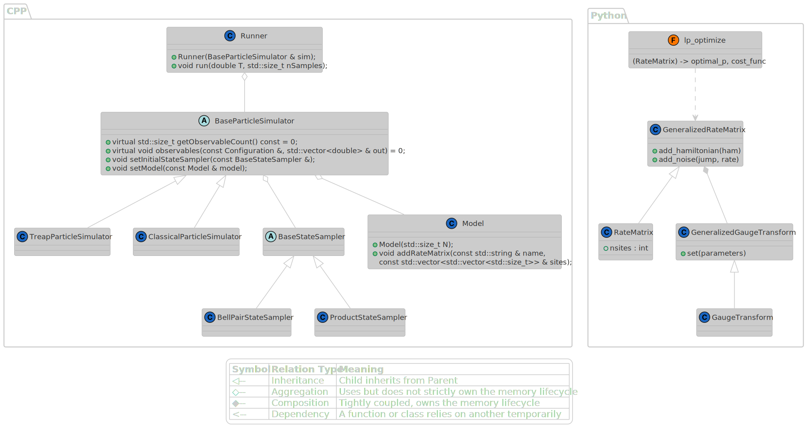

# MarQu

A library for simulating the Schrödinger equation of spin chains based on a classical stochastic interpretation as a continuous-time Markov chain. 

Details of the underlying mathematical formulation and algorithm implementation can be found in:

**TBA**

If you use this code in your research please cite the work above.


## Features

MarQu splits the problem of quantum simulation into two distinct steps: a Python-based preprocessing phase for mathematical optimization, and a high-performance C++ engine for the Monte Carlo execution.

* **Rate Matrix Generation (Python):** Construct transition rate matrices from arbitrary local Hamiltonian and Lindbladian/noise terms.
* **Optimal Gauge Transformation (Python):** Utilizes Linear Programming (`scipy.optimize.linprog`) to find the optimal gauge transformation that minimizes the sum of negative rates, effectively mitigating the sign problem and particle proliferation.
* **High-Performance Simulation Engine (C++):** 
    * `TreapParticleSimulator`: Handles "negative" Markov chains by simulating particles and antiparticles.
Uses a dynamic Treap (Tree + Heap) data structure to maintain efficient O(log N) insertion, deletion, and annihilation operations.
    * `ClassicalParticleSimulator`: Optimized simulator for regimes where sufficient noise has driven the system into a purely classical state (all positive rates).
* **Initial State Sampling:** Built-in support for sampling Product States and volume-law entangled non-local Bell Pair states.

## Install guide

Install with `./install.sh` and uninstall with `./unistall.sh`.

## Architecture Diagrams

Below is the high-level design of MarQu outlining the primary user-facing APIs for both the C++ simulation engine and the Python preprocessing package. 

*(PlantUML source available in the `diagram/` directory).*



## Example

The `examples` directory contains a fully functional pipeline simulating a 2D Transverse-Field Ising Model (TFIM) subjected to depolarizing noise. It demonstrates how to initialize highly entangled states and track the decay of quantum correlations.

To run the full pipeline, simply navigate to the `examples` directory and execute the bash script:
```bash
cd examples
./run.sh
```

### What happens under the hood?

1. **Setting up the Grid (`generate_pairs.py`):**
   First, the script generates a set of disjoint site pairs on a 2D grid. These pairs will be used to initialize the system in a highly non-trivial, volume-law entangled state composed of Bell pairs.

2. **Optimizing the Quantum Dynamics (`tfim.py`):**
   Using the `marqu` Python library, the script defines the local Hamiltonian (TFIM) and Lindbladian noise channels. It then runs the `lp_optimize` linear programming solver to find the optimal gauge transformation that minimizes negative transition rates. The optimized transition matrices are exported to the `marqu_data/rate_matrix` directory.

3. **Running the Monte Carlo Simulation (`tfim.cpp` & `main.cpp`):**
   The C++ engine compiles and takes over. It loads the optimized rate matrices and uses the `TreapParticleSimulator` to evolve the state of the system over time using the Gillespie algorithm. 

4. **Tracking Observables:**
   During the simulation, the engine continuously estimates specific Pauli strings. Specifically, it calculates the connected two-point correlations (both short-range and long-range) between the initially entangled Bell pairs, outputting their decay as the simulation progresses.

